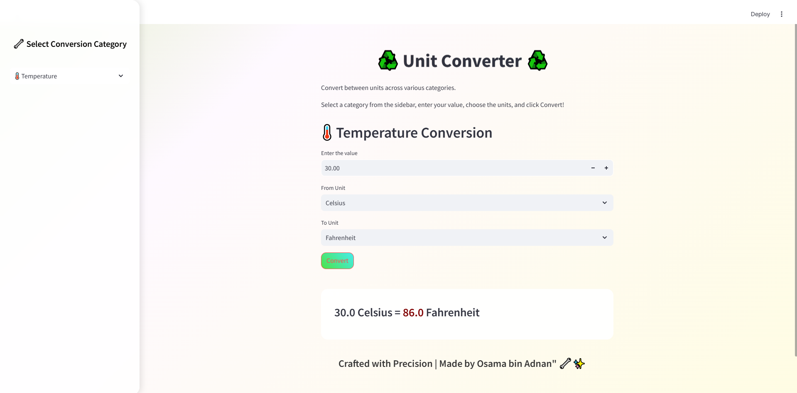

# Unit Converter

## Effortless Conversions, Infinite Possibilities!

### Overview
Unit Converter is a powerful and easy-to-use web application built with **Streamlit** that allows users to seamlessly convert values across various measurement units. With an elegant interface and smooth animations, converting units has never been easier!

### Features
- 📏 **Length Conversion** (Meters, Kilometers, Miles, Yards, Feet, Inches, etc.)
- 🌡️ **Temperature Conversion** (Celsius, Fahrenheit, Kelvin)
- 🗺️ **Area Conversion** (Square Meters, Acres, Hectares, etc.)
- ⚖️ **Mass Conversion** (Kilograms, Pounds, Ounces, etc.)
- 📶 **Data Transfer Rate Conversion** (bps, Kbps, Mbps, Gbps, etc.)
- 💾 **Digital Storage Conversion** (Bytes, Kilobytes, Megabytes, etc.)
- ⚡ **Energy Conversion** (Joules, Calories, BTUs, etc.)
- 🔄 **Frequency Conversion** (Hertz, Kilohertz, Megahertz, etc.)
- ⛽ **Fuel Economy Conversion** (Miles per Gallon, Liters per 100km, etc.)
- 📐 **Plane Angle Conversion** (Degrees, Radians, Gradians, etc.)
- 🌡️ **Pressure Conversion** (Pascal, Bar, Atmosphere, PSI, etc.)
- 🚀 **Speed Conversion** (m/s, km/h, mph, Knots, etc.)
- ⏳ **Time Conversion** (Seconds, Minutes, Hours, Days, etc.)
- 🧪 **Volume Conversion** (Liters, Milliliters, Cubic Meters, etc.)

### Technologies Used
- **Python**
- **Streamlit** (for web-based UI and functionality)
- **CSS** (for enhanced styling and animations)
- **Math & Conversion Algorithms**

### Usage
1. Select a category from the sidebar (e.g., Length, Temperature, Mass, etc.).
2. Enter the value you want to convert.
3. Choose the source and target units.
4. Click the **Convert** button to get instant results!

### Screenshots
📷 __

### Contribution
Feel free to contribute to this project by submitting issues and pull requests!

### License
This project is open-source and available under the **MIT License**.

---
Happy Converting! ♻️

